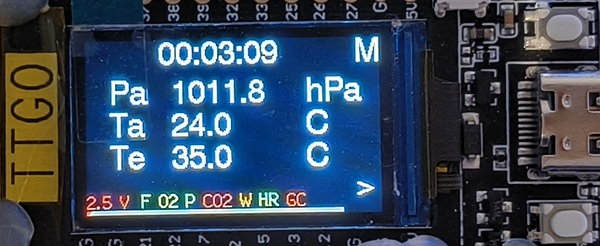
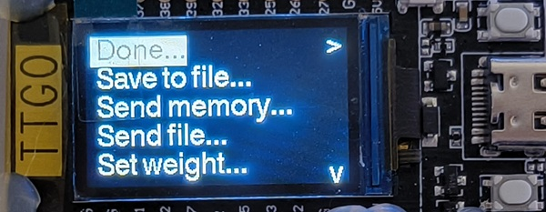
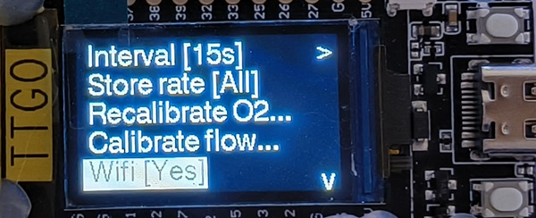
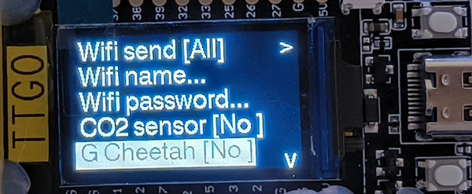
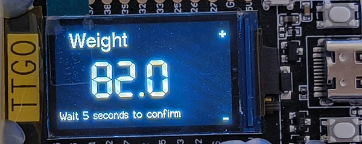
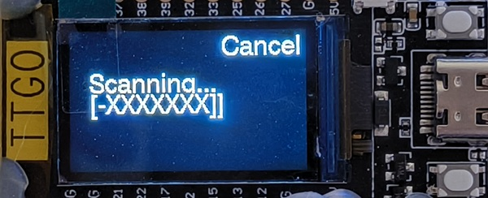
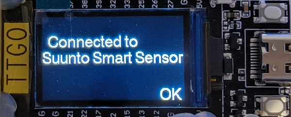

# How to use VO2Max
This document describes basic usage of the VO2Max portable spirometer.

## Getting started

The device is powered on either by plugging in USB-C cable or by connecting a Li-Ion battery to the T-Display board.

After power on, the oxygen sensor requires 3 minutes of warm-up for measurement to be stable and accurate. A timer will be shown on the display counting down from 180 every second and displaying the oxygen sensor reading. This screen can be skipped if device has been previously running. After the time has passed or the wait was skipped, the oxygen sensor reading will be used as initial base-level oxygen contentration. For this reason, the sensor should be vented with fresh air if rebooted (do NOT blow into the sensor/mask as exhale air has low oxygen contenration!).

A default status screen will be shown. In the status screen top row shows currently elapsed time. Then values (depending on the selected status screen) will be shown, like VO2 value and heart rate, or like in example below, ambient pressure and temperature and exhale temperature.



On the bottom of the status screen a list of symbols show the status of the device:

| Symbol | Description |
|--------|-------------|
| 2.5V  | Battery voltage. If USB cable is connected, charging supply voltage. Color indicates state: Blue=charger connected, green=full, yellow=normal, red=low |
| F      | Air flow (pressure) sensor status. Green=ok, red=error/disabled |
| O2     | Oxygen sensor status. Green=ok, red=error/disabled |
| P      | Ambient pressure sensor status. Green=ok, red=error/disabled |
| CO2    | CO2 sensor status. Green=ok, red=error/disabled |
| W      | Wifi status. Green=wifi on & client(s) connected, yellow=wifi on (no clients), red=off/error |
| HR     | BLE Heart rate sensor status. Green=enabled & connected, yellow=enabled (not connected), red=disabled/error |
| GC     | Golden cheetah status. Green=enabled & connected, yellow=enabled (not connected), red=disabled/error |

The final line on the status screen shows internal data storage buffer status. Red means used memory, while grey means free memory. The line slowly fills with red until the buffer is full and oldest data will get overwritten.

The T-Display has two buttons on the right side. The top one, labeled ```M``` enters the menu while the bottom one (```>```) changes the status screen. On the top there is a small reset button which resets the processor.

## Using the menu

Menu is opened by pressing the top (```M```) button while in status screen. In the menu the top button (```>```) selects the currently highlighted menu item while the bottom button (```V```) moves to the next menu item. When reaching the last item, the bottom button jumps back to the first menu item. The menu structure is described below.



| Menu item | Description |
|-----------|-------------|
| Done... | Close the menu and apply & save any changes. Settings will be stored and remembered over reboot |
| Save to file... | Save the storage buffer (all the recorded values) to flash memory |
| Send memory... | Send the recorded memory buffer over WiFi to a computer |
| Send file... | Send the saved record file to a computer over WiFi |
| Set weight... | Set the user's weight in kg |
| Interval [15s] | Set the calculation interval (shows the value in brackets). Possible values: 5s, 10s, 15s, 30s, 60s. Default 15s |
| Store rate [All] | Set the memory storage rate. Options: All=store every calculation result, 1:2=store every other calculation result, 1:3=store one third, 1:5=store one fifth, 1:10=store every tenth. Default All |
| Recalibrate O2... | Trigger O2 sensor recalibration. Must be done when the sensor has been in fresh air for a long time. Expected to see 20.93 % oxygen concentration when calibrating |
| Calibrate flow... | Calibrate the flow sensor. First asks for the calibration syringe volume and then prompts user to empty the syringe through the mask. Flow sensor correction factor will be applied based on the difference between measured and expected volumes |
| Wifi [Yes] | Enable or disable Wifi. Options Yes=enable, No=disable |
| Wifi name... | Set the Wifi network name that will be created by VO2Max |
| Wifi password... | Set the Wifi network password |
| CO2 sensor [No] | Use CO2 sensor. Options Yes=Use the CO2 sensor, No=don't use CO2 sensor |
| G Cheetah [No] | Enable Golden Cheetah bluetooth feature. Options Yes=enable, No=disable |
| HR sensor [Yes] | Enable use of Bluetooth LE heart rate sensor. Options Yes=enable, No=disable |
| HR scan... | Scan for Bluetooth LE heart rate sensors. Scans for about 10 seconds and connects to the first heart rate sensor found, if any. The sensor (address) will be stored and connected automatically when powering up |
| Start over... | Reset all calculations, storage memory and elapsed time |






Notes:
 - When selecting menu item with discrete set of options, the select button (top, ```>```) selects the next option. From the last option, the selection returns to the first
 - When entering numbers (like weight), top button (```+```) increases the value and bottom button (```-```)decreases. Waiting for 5 seconds without pressing any buttons accepts the value 
 - When entering text (like Wifi name), top button (```>```) goes to next character and bottom button (```V```) changes the currently selected character. Waiting for 5 seconds without pressing any buttons accepts the value
 - Heart rate sensor scanning looks like following:  

